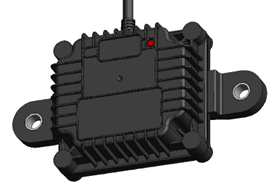

# Components

## Receiver

The new generation of the TPMS transceivers, for Tractors and Trailers, highlighted features are described below:

### Sensor Reception

- Two fully independent channels for data reception.
- Receiving and decoding in parallel two separated sensor types.
- 433MHz, FSK or OOK modulation.
- Precise RSSI (signal strength) measurement
- Sensitivity: -96 dBm

### Electrical Specifications

- Operating Voltage: 7 – 32V.
- Working current: ≤ 30mA@24V.
- Working temperature: -40°C - 85°C.
- Overvoltage protection.
- Low power mode when operating from battery pack (external).
- Powered by EFR32BG22 chipset.

### Wired Communication

- Proprietary CAN-Bus J1939-based.
- Compatible with ISO11992.
- Configurable CAN baud-rate between 250kbps and 500kbps.
- Configurable CAN address for multi-receiver setup.
- Proprietary RS232 Protocol.
- Configurable RS232 baud-rate between 4.8kbps and 115.2kbps.
  
### Wireless Communication

- The Upload button sends the complete vehicle configuration to the server. This includes:
  
- Bluetooth Low Energy 5.2 compliant.
- BLE Connection available for setup, diagnosis and firmware update.
- Trailer TPMS data wirelessly forwarded to Tractor unit (BLE).
- Daisy-chain BLE communication for multiple-trailers setup or range extension.
- User-transparent Trailer Drop&Hook.
- Configurable transmissions schemes for different applications: gate, telematics, yard reading.

### Connector

1 meter pigtail cable with TE-1718230-1 connector:

|**Pin Number** | **Description**                        |
|----------------|--------|
| 1  | CAN-L        |
| 2  | RS232-Tx     |
| 3  | GND          |
| 4  | RS232-Rx     |
| 5  | NC           |
| 6  | CAN-H        |
| 7  | Power        |

### Mechanical Package

- Designed for heavy-duty automotive environment (water, dust, shocks, etc.).
- Weight: 190g.
- Dimensions: 80x126x51mm (LxWxH) .
- IP69 rating
- RGB LED available for diagnosis.
- Material: PA66+GF30.

### Flexible Configuration

- CAN and RS232 baud-rate configuration.
- CAN Termination resistor ON/OFF.
- RF 433MHz RX protocols.
- Vehicle Type: Tractor or Trailer.
- Transmission Type: RS232, CAN or BLE.
- Enable/Disable low power mode detection.
- Allows for OTA firmware update.
- Configurable through a smart device.

{ width="400px"}
