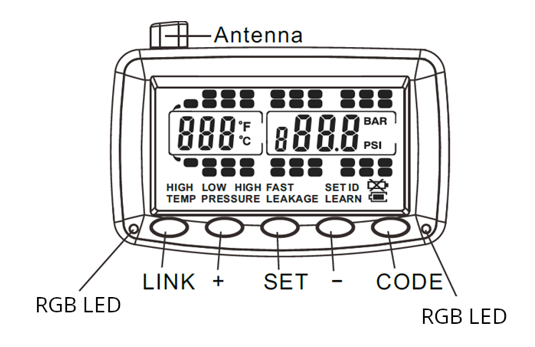

# Display

## Specification

The new generation of the TPMS displays, for in-cabin information directly to the driver.

### Sensor Reception

- Two fully independent channels for data reception.
- Receiving and decoding in parallel two separated sensor types.
- 433MHz, FSK or OOK modulation.
- Precise RSSI (signal strength) measurement
- Sensitivity: -96 dBm

### Electrical Specifications

- Operating Voltage: 7 – 32V.
- Working current: ≤ 10mA@24V.
- Working temperature: -20°C - 80°C.
- Overvoltage protection up to 45V.
- Wake-up vibration detection.

  
### Wireless Communication

- Using state-of-the-art 2.4GHz communication protocol. 
- Connection available for setup, diagnosis and firmware update.
- Receiving data directly from any Truck unit.
- Daisy-chain 2.4GHz communication for multiple-trailers setup or range extension.
- User-transparent Trailer Drop&Hook.

### User interface

- Two RGB LEDs for different warning levels.
- Internal buzzer.
- Five buttons for user interation.
- Handles Trucks with up to 5 axles.
- Handles Trailers with up to 6 axles.

{ width="400px"}

### Connector

1 meter pigtail cable.

### Mechanical Package

- Designed for heavy-duty automotive environment.
- Weight: 125g.
- Dimensions: 116x68x25mm (LxWxH).
- Includes Bracket&Screw.

{ width="400px"}

## Buttons Functionality

### LINK
Pair the Display with an existing Truck Transceiver. Press and hold to enter the pairing screen and click SET to initiate the automatic pairing process.

### SET
Change the units in the display, between PSI/Bar and Celsius/Fahrenheit.

### CODE
Change the number of Trailers handled by the Display. This number should match the number of Trailers configured in the Truck Transceiver. Press and hold to enter the screen. 

### +/-
Navigate through the received wheels.

