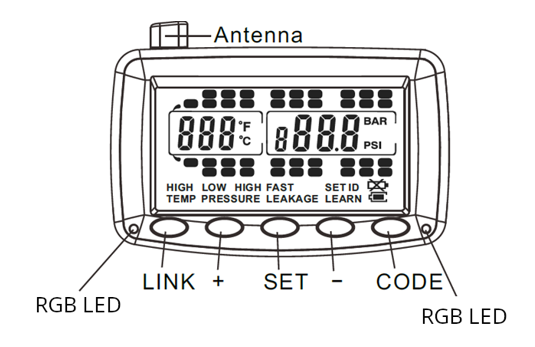

# Specification

The new generation of the TPMS displays, for in-cabin information directly to the driver.

## Functional Description

The Display only works when paired to a 
Truck Transceiver. Once paired, it will
automatically show all wheels configured in
that Transceiver, including the Trailers.

## Electrical Specifications

- Operating Voltage: 7 – 32V.
- Working temperature: -20°C - 80°C.
- Storage temperature: -30°C - 85°C.
- Overvoltage protection up to 45V.
- Powered by EFR32BG22 chipset.
- ON/OFF Vibration switch sensor.
- Average consumption: 7mA.

## Wireless Communication

- Using state-of-the-art 2.4GHz communication protocol.
- Connection available for setup, diagnosis and firmware update.
- Receiving data directly from any Truck unit.
- Daisy-chain 2.4GHz communication for multiple-trailers setup or range extension.
- User-transparent Trailer Drop&Hook.

## User interface

- Two RGB LEDs for different warning levels.
- Internal buzzer.
- Five buttons for user interation.
- Handles Trucks with up to 4 axles.
- Handles Trailers with up to 6 axles.

{ width="600px"}

## Connector

1-meter pigtail power cable with a cigarette plug.

## Mechanical Package

- Designed for heavy-duty automotive environment.
- Weight: 125g.
- Dimensions: 116x68x25mm (LxWxH).
- Includes Bracket&Screw.

{ width="450px"}
