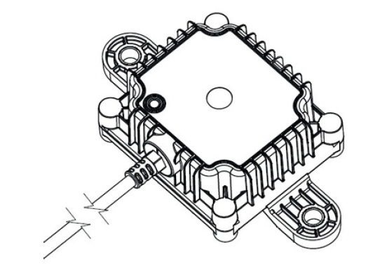
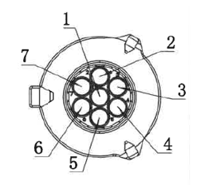
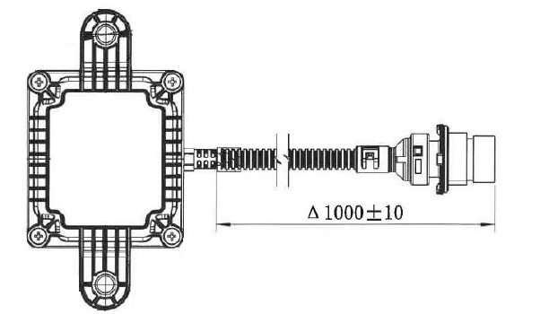
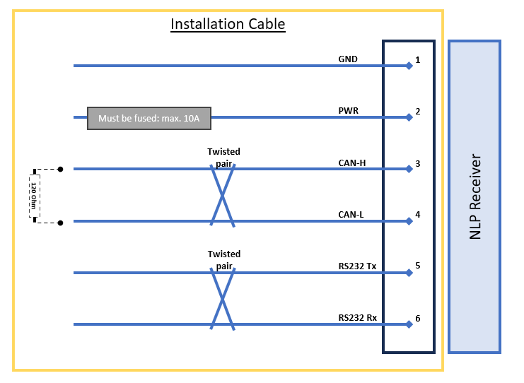
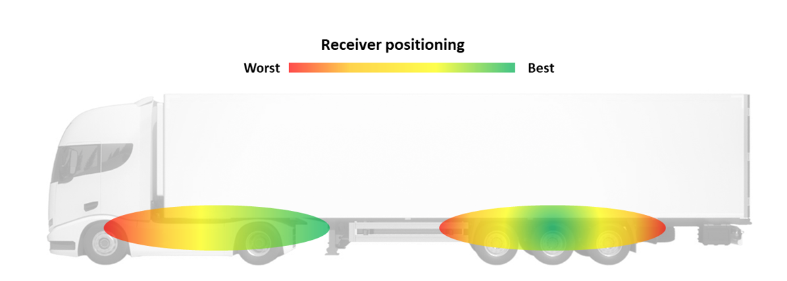
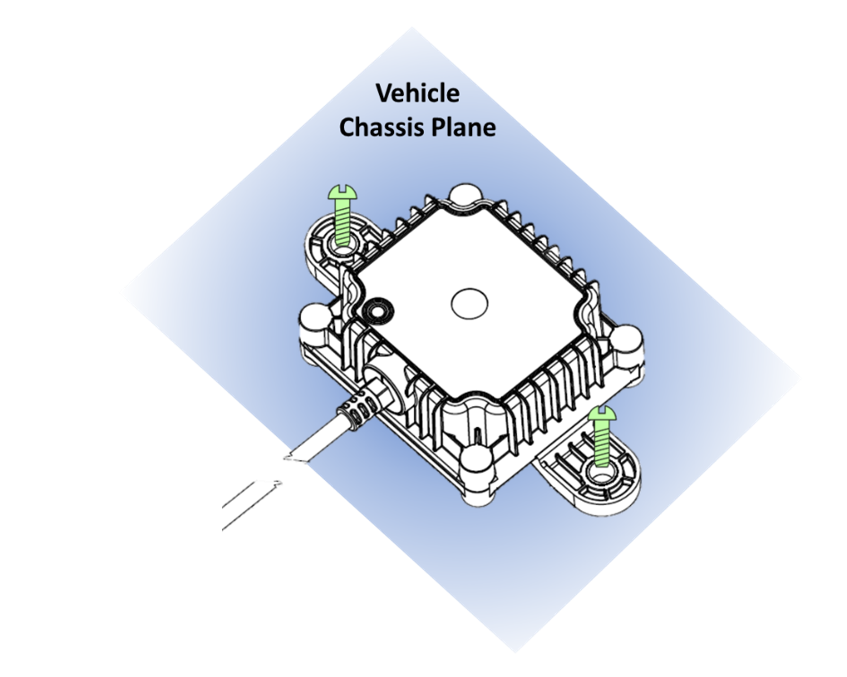
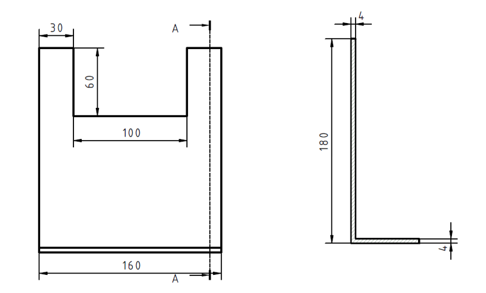

# Receiver

## Specification

The new generation of the TPMS transceivers, for Trucks and Trailers, highlighted features are described below:

### Sensor Reception

- Two fully independent channels for parallel data reception.
- Receiving and decoding in parallel two separated sensor types.
- 433MHz, FSK or OOK modulation.
- Precise RSSI (signal strength) measurement

### Electrical Specifications

- Operating Voltage: 7 – 32V.
- Working current: ≤ 50mA@24V.
- Working temperature: -40°C - 85°C.
- Automotive overvoltage protection.
- Powered by EFR32BG22 chipset.

### Wired Communication

- Proprietary CAN-Bus J1939-based.
- Compatible with ISO11992.
- Configurable CAN baud-rate.
- Configurable CAN address for multi-receiver setup.
- Configurable CAN Termination.
- Proprietary RS232 Protocol.
- Configurable RS232 baud-rate between 4.8kbps and 115.2kbps.
- (Optional) RS485 communication bus.
  
### Wireless Communication
  
- Using state-of-the-art 2.4GHz communication protocol. 
- Connection available for setup, diagnosis and firmware update.
- Trailer TPMS data wirelessly forwarded to Truck unit.
- Daisy-chain 2.4GHz communication for multiple-trailers setup or range extension.
- User-transparent Trailer Drop&Hook.
- Configurable transmissions schemes for different applications: gate, telematics, yard reading.

## Enclosure

### Mechanical Package

- Designed for heavy-duty automotive environment (water, dust, shocks, etc.).
- Weight: 190g.
- Dimensions: 80x126x51mm (LxWxH) .
- IP69 rating
- RGB LED available for diagnosis.
- Material: PA66+GF30.

{ width="400px"}

### Connector

Included a 1 meter pigtail cable with TE-1718230-1 connector:

|**Pin Number** | **Description**                        |
|----------------|--------|
| 1  | CAN-L        |
| 2  | RS232-Tx     |
| 3  | GND          |
| 4  | RS232-Rx     |
| 5  | NC           |
| 6  | CAN-H        |
| 7  | Power        |

{ width="150px"}

The matching connector for an installation cable is the following:
- Matching Connector: TE PN 967650-1
- Matching Terminal: TE PN 929989-1

{ width="400px"}

### General Wiring

The general wiring of the NLP receiver follows the picture:

{ width="700px"}

Attention to the following notes:
- A fuse **must** be added to the power line of the receiver, or the power line must come directly from the fuse box.
- The receiver power (PIN 7) must come from **K15** (Vehicle Ignition).
	- Do **not** connect it to permanent power (K30).
- Connect the ground wire (PIN 3) to the vehicle ground (K31). 
- _[Optional]_ CAN Bus connection:
	- Connect the CAN-H and CAN-L wires to the corresponding CAN bus connection
	- The NLP receiver includes a 120 Ohm termination resistor, which can be disabled.
	- If the desired CAN-Bus is not terminated, a 120 Ohm termination resistor is required
- _[Optional]_ RS232 connection:
	- Connect the RS232 Tx and RS232 Rx wires to the corresponding RS232 interface connection
- We recommend using twisted pairs for all communication wires: CAN and RS232.

### Wiring with Telematics

If the receiver will be installed with a Telematics box, please follow the guidelines below:

- The Telematics unit requires Power (K30) and Ignition (K15).
	- The NLP Receiver **must** still be supplied with the ignition signal (K15).
	- A fuse must be added to both power and ignition signals.
- The Telematics unit does not have a CAN termination. A 120-Ohms termination resistor must be added to the cable as close as possible to the Telematics unit, between CAN High and Low (Telematics pins 4 and 5).

### Wiring with EBS (Trailers) 

For Trailer installations is recommended to get power by connecting the transceiver to the EBS system. A different suite of cables is required depending on the EBS system and if the CAN communication for EU-R141 will be required.

- The Trailer owner must ensure that the EBS system is already setup to provide power (and communication) in the chosen port.

#### Wabco (ZF) TEBS-E 

##### EU-R141 Communication

##### Power only

#### Haldex G2/G3

##### Power only

#### Haldex 4.0

##### EU-R141 Communication

##### Power only

#### Knorr-Bremse G2.2

##### EU-R141 Communication

##### Power only

#### Knorr-Bremse iEBS

##### EU-R141 Communication

##### Power only

## Installation

The range of the sensors is restricted. Consequently, we generally advise determining an installation placement for the NLP receiver that is relatively central to all the installed sensors sending data to it, ensuring dependable data transmission.
Consider the following recommendations when identifying the optimal mounting position for the NLP receiver:

- Aim for an unobstructed line of sight between the NLP receiver and the corresponding sensors, or at least the wheels.
- Steer clear of any metal barriers between the NLP receiver and the associated sensors that could impede reception, such as a trailer pallet box or an air tank.
- When seeking the ideal position for the NLP receiver, prioritize the distance to sensors placed in more challenging environments, like deep rims or twin wheels. 
- For trucks, the NLP receiver should be closer to the driving axle (deep rims, twin wheels) than the steering axle.
- Place the NLP receiver where the temperature remains within the specified operating range and away from devices generating heat.
- Maintain a minimum distance of at least 20 cm between the NLP receiver and any high-bitrate cables and 50 cm from electric motors, alternators, or other electrical machines with coils and windings.
- Begin by setting up the first vehicle of a particular type in a fleet and thoroughly verify its performance. Subsequent vehicles of the same type can then be replicated with less time spent on performance verification.

{ width="800px"}

For ECE R141 Trailer Gateway compliance, ue to the limited distance of RF transmission especially under the condition of permanently moving sensors in the tyres, the maximum distance between the sensor and receiver must be considered.
- Sensor to Receiver distance1 limitation:	4,5 m

### Fixation

The receiver can be affected by interference, so it's important to install it properly. Place the unit with its top side, which includes antennas,  facing outward (away from any metal). Make sure the top, face with laser markings and LEDs, is not obstructed.
The bottom of the receiver should be in direct contact with the vehicle chassis or mounting position. Avoid leaving any gaps that could cause vibrations between the unit and the vehicle chassis.
To secure the unit to the vehicle chassis, you can use M8 screws (not included) in existing holes. Alternatively, use cable ties to fasten the unit in your preferred position. Remember not to use metal ties.

{ width="400px"}

### Bracket

We also recommend the usage of a bracket, helping moving the transceiver away from other devices and cables. The bracket can be fixed to existing holes in the chassis, facilitating the installation overall. One possible bracket is as follows (not included):

{ width="600px"}

## Configuration and Diagnostics

For a complete installation diagnostic, use our smart app, available at both PlayStore and AppStore.

### LEDs

The in-built RGB LED for diagnosis is a visual indicator to inform about the operational status or health of the system. These LEDs are designed to emit different colours or patterns to communicate specific messages, providing users or technicians with a quick and intuitive way to assess the condition of the device. See the below description to identify the system status through the status LED.

The receiver will always blink **4 times** in a row. Each blink has a different meaning:

{ width="300px"}

#### 1st Blink - RF Status
|**Color** | **Description**                        |
|---------|---------------------------|
| RED | Channels 1 and 2 not receiving frames |
| GREEN  | Channel 1 or 2 receiving frames |
| BLUE  | Channels 1 and 2 receiving frames  |

#### 2nd Blink - 2.4GHz Link Status
|**Color** | **Description**                        |
|---------|---------------------------|
| RED | Advertising only |
| GREEN  | Advertising and scanning |
| BLUE  | Connected  |

#### 3rd Blink - CAN/UART Status
|**Color** | **Description**                        |
|---------|---------------------------|
| RED | CAN/UART self-diagnostic failed |
| GREEN  | CAN/UART working, but no data received |
| BLUE  | CAN/UART working and data has been received  |

#### 4th Blink - General
|**Color** | **Description**                        |
|---------|---------------------------|
| RED | Always RED |

## Certificates

Attaching certifications to our Tire Pressure Monitoring System (TPMS) receiver enhances trust, safety, and market acceptance. Certified devices ensure compliance with international standards, reflecting rigorous testing for performance, reliability, and safety. These certifications help validate electromagnetic compatibility, environmental resilience, and radio frequency compliance, ensuring the receiver operates without interference and meets industry regulations. However, quality concerns arise if certificates are not properly maintained or regularly updated, as outdated or invalid certifications may undermine credibility and risk non-compliance, leading to fines, product recalls, or customer dissatisfaction.
Call for Compliance

To ensure the highest quality and regulatory compliance, our TPMS receiver must adhere to the following standards:

- CE-RED (Radio Equipment Directive)
- ECE R10
- ECE R141 Trailer Gateway Compliance
- FCC/IC Certification
- RoHS Directive (2011/65/EU) 
- REACH Regulation ((EC) No 1907/2006) 
- WEEE Directive (2012/19/EU)

Adhering to these certifications assures customers and regulators of the TPMS receiver's quality, reliability, and safety across global markets.

{ width="400px"}
