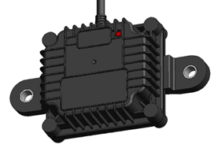

# Certificates

Attaching certifications to our Tire Pressure Monitoring System (TPMS) receiver enhances trust, safety, and market acceptance. Certified devices ensure compliance with international standards, reflecting rigorous testing for performance, reliability, and safety. These certifications help validate electromagnetic compatibility, environmental resilience, and radio frequency compliance, ensuring the receiver operates without interference and meets industry regulations. However, quality concerns arise if certificates are not properly maintained or regularly updated, as outdated or invalid certifications may undermine credibility and risk non-compliance, leading to fines, product recalls, or customer dissatisfaction.
Call for Compliance

To ensure the highest quality and regulatory compliance, our TPMS receiver must adhere to the following standards:

- CE-RED (Radio Equipment Directive)
- ECE R10
- ECE R141 Trailer Gateway Compliance
- FCC/IC Certification
- RoHS Directive (2011/65/EU)
- REACH Regulation ((EC) No 1907/2006)
- WEEE Directive (2012/19/EU)

Adhering to these certifications assures customers and regulators of the TPMS receiver's quality, reliability, and safety across global markets.

{ width="400px"}
