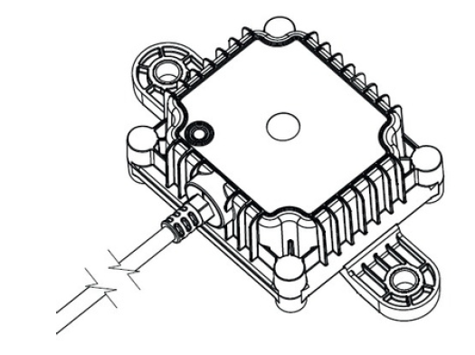
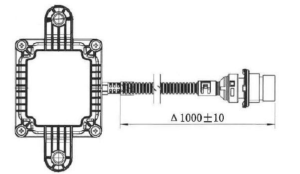
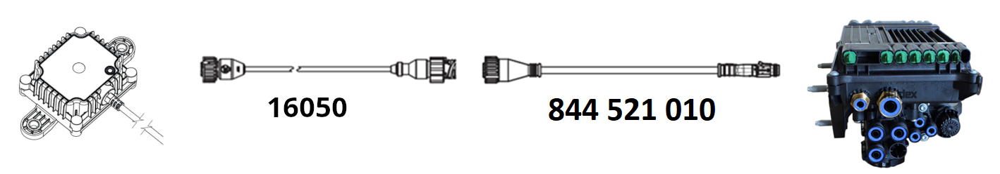

# Enclosure and Cables

## Mechanical Package

- Designed for heavy-duty automotive environment (water, dust, shocks, etc.).
- Weight: 190g.
- Dimensions: 80x126x51mm (LxWxH).
- IP69 rating.
- RGB LED available for diagnosis.
- Material: PA66+GF30.

{ width="400px"}

## Connector

Included a 1 meter pigtail cable with TE-1718230-1 connector:

|**Pin Number** | **Pin Description** | **Color** |
|:----------------:|:--------:|:--------:|
| 1  | CAN-L        |WHITE    |
| 2  | RS232-Tx     |BROWN       |
| 3  | GND          |GREEN        |
| 4  | RS232-Rx     |RED    |
| 5  | NC           |        |
| 6  | CAN-H        |BLACK      |
| 7  | Power        |BLUE      |

|**Pinout** | **Pigtail**                        |
|:----------------:|:--------:|
| { width="200px"}  | { width="300px"}      |

The matching connector for an installation cable is the following:

- Matching Connector: TE PN 967650-1
- Matching Terminal: TE PN 929989-1

## General Wiring

The general wiring of the receiver follows the picture:

{ width="700px"}

!!! note "Attention to the following notes"

    - A fuse **must** be added to the power line of the receiver, or the power line must come directly from the fuse box.
    - The receiver power (PIN 7) must come from **K15** (Vehicle Ignition).
        - Do **not** connect it to permanent power (K30).
    - Connect the ground wire (PIN 3) to the vehicle ground (K31). 
    - _[Optional]_ CAN Bus connection:
        - Connect the CAN-H and CAN-L wires to the corresponding CAN bus connection
        - The receiver includes a 120 Ohm termination resistor, which can be disabled.
        - If the desired CAN-Bus is not terminated, a 120 Ohm termination resistor is required
    - _[Optional]_ RS232 connection:
        - Connect the RS232 Tx and RS232 Rx wires to the corresponding RS232 interface connection
    - We recommend using twisted pairs for all communication wires: CAN and RS232.

## Wiring with EBS (Trailers)

For Trailer installations is recommended to get power by connecting the transceiver to the EBS system. A different suite of cables is required depending on the EBS system and if the CAN communication for EU-R141 will be required.

- The Trailer owner must ensure that the EBS system is already setup to provide power (and communication) in the chosen port.

### Wabco (ZF) TEBS-E

#### EU-R141 Communication

For R141 compliance, you can use the GIO5 port. The installer must use the cable **449 915 010 0** from Wabco, connected to our cable **16050**.

{ width="800px"}

Optional you can use the SUBSYSTEM port. The installer must use the cable **449 913 050 0** from Wabco.

{ width="800px"}

#### Power only

For aftermarket installations, any free GIOx port can be used. The installer must use the cable **449 443 010 0** from Wabco, connected to our cable **16050**.

{ width="800px"}

### Haldex G2/G3

#### Power only

For aftermarket installations, any free AUX port can be used. The installer must use the cable **814 012 221** from Haldex, connected to our cable **16050**.

{ width="800px"}

### Haldex 4.0

#### EU-R141 Communication

For R141 compliance, one must use the AUX port. The installer must use the cable **884 321 010** from Haldex, connected to our cable **16050**.

{ width="800px"}

#### Power only

For aftermarket installations, any free AUX port can be used. The installer must use the cable **884 321 010** from Haldex, connected to our cable **16050**.

{ width="800px"}

### Knorr-Bremse G2.2

#### EU-R141 Communication

For R141 compliance, one must use the AUX port. The installer must use the cable **15792**.

{ width="800px"}

#### Power only

For aftermarket installations, one must use the AUX port. The installer must use the cable **15792**.

{ width="800px"}

### Knorr-Bremse iTEBS X

#### EU-R141 Communication

For R141 compliance, one must use the AUX port. The installer must use the cable **15782**.

{ width="800px"}

#### Power only

For aftermarket installations, one must use the AUX port. The installer must use the cable **15782**.

{ width="800px"}

## Wiring with Telematics

If the receiver will be installed with a Telematics box, please follow the guidelines below:

- The Telematics unit requires Power (K30) and Ignition (K15).
    - The Receiver **must** still be supplied with the ignition signal (K15).
    - A fuse must be added to both power and ignition signals.
- The Telematics unit does not have a CAN termination. A 120-Ohms termination resistor must be added to the cable as close as possible to the Telematics unit, between CAN High and Low (Telematics pins 4 and 5).

{ width="700px"}
