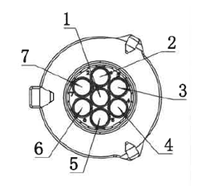
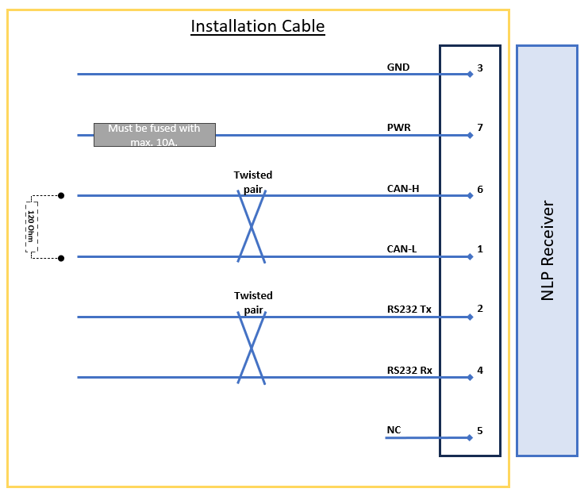

## Enclosure and Cables

### Mechanical Package

- Designed for heavy-duty automotive environment (water, dust, shocks, etc.).
- Weight: 190g.
- Dimensions: 80x126x51mm (LxWxH) .
- IP69 rating
- RGB LED available for diagnosis.
- Material: PA66+GF30.

{ width="400px"}

### Connector

Included a 1 meter pigtail cable with TE-1718230-1 connector:

|**Pin Number** | **Description**                        |
|----------------|--------|
| 1  | CAN-L        |
| 2  | RS232-Tx     |
| 3  | GND          |
| 4  | RS232-Rx     |
| 5  | NC           |
| 6  | CAN-H        |
| 7  | Power        |

{ width="150px"}

The matching connector for an installation cable is the following:
- Matching Connector: TE PN 967650-1
- Matching Terminal: TE PN 929989-1

{ width="400px"}

### General Wiring

The general wiring of the NLP receiver follows the picture:

{ width="700px"}

Attention to the following notes:
- A fuse **must** be added to the power line of the receiver, or the power line must come directly from the fuse box.
- The receiver power (PIN 7) must come from **K15** (Vehicle Ignition).
	- Do **not** connect it to permanent power (K30).
- Connect the ground wire (PIN 3) to the vehicle ground (K31). 
- _[Optional]_ CAN Bus connection:
	- Connect the CAN-H and CAN-L wires to the corresponding CAN bus connection
	- The NLP receiver includes a 120 Ohm termination resistor, which can be disabled.
	- If the desired CAN-Bus is not terminated, a 120 Ohm termination resistor is required
- _[Optional]_ RS232 connection:
	- Connect the RS232 Tx and RS232 Rx wires to the corresponding RS232 interface connection
- We recommend using twisted pairs for all communication wires: CAN and RS232.

### Wiring with Telematics

If the receiver will be installed with a Telematics box, please follow the guidelines below:

- The Telematics unit requires Power (K30) and Ignition (K15).
	- The NLP Receiver **must** still be supplied with the ignition signal (K15).
	- A fuse must be added to both power and ignition signals.
- The Telematics unit does not have a CAN termination. A 120-Ohms termination resistor must be added to the cable as close as possible to the Telematics unit, between CAN High and Low (Telematics pins 4 and 5).

### Wiring with EBS (Trailers) 

For Trailer installations is recommended to get power by connecting the transceiver to the EBS system. A different suite of cables is required depending on the EBS system and if the CAN communication for EU-R141 will be required.

- The Trailer owner must ensure that the EBS system is already setup to provide power (and communication) in the chosen port.

#### Wabco (ZF) TEBS-E 

##### EU-R141 Communication

##### Power only

#### Haldex G2/G3

##### Power only

#### Haldex 4.0

##### EU-R141 Communication

##### Power only

#### Knorr-Bremse G2.2

##### EU-R141 Communication

##### Power only

#### Knorr-Bremse iEBS

##### EU-R141 Communication

##### Power only
