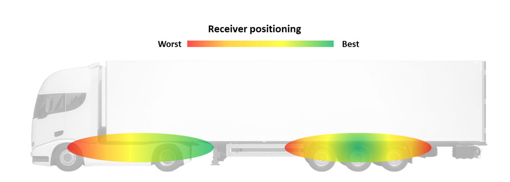
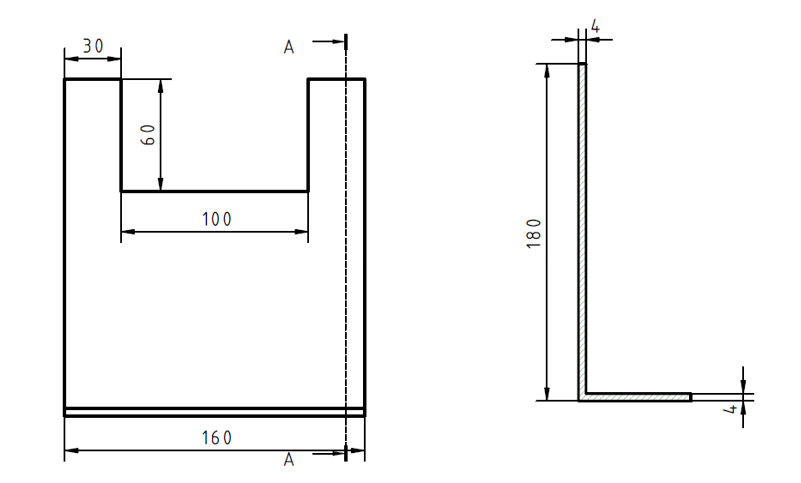

## Installation

The range of the sensors is restricted. Consequently, we generally advise determining an installation placement for the NLP receiver that is relatively central to all the installed sensors sending data to it, ensuring dependable data transmission.
Consider the following recommendations when identifying the optimal mounting position for the NLP receiver:

- Aim for an unobstructed line of sight between the NLP receiver and the corresponding sensors, or at least the wheels.
- Steer clear of any metal barriers between the NLP receiver and the associated sensors that could impede reception, such as a trailer pallet box or an air tank.
- When seeking the ideal position for the NLP receiver, prioritize the distance to sensors placed in more challenging environments, like deep rims or twin wheels. 
- For trucks, the NLP receiver should be closer to the driving axle (deep rims, twin wheels) than the steering axle.
- Place the NLP receiver where the temperature remains within the specified operating range and away from devices generating heat.
- Maintain a minimum distance of at least 20 cm between the NLP receiver and any high-bitrate cables and 50 cm from electric motors, alternators, or other electrical machines with coils and windings.
- Begin by setting up the first vehicle of a particular type in a fleet and thoroughly verify its performance. Subsequent vehicles of the same type can then be replicated with less time spent on performance verification.

{ width="800px"}

For ECE R141 Trailer Gateway compliance, ue to the limited distance of RF transmission especially under the condition of permanently moving sensors in the tyres, the maximum distance between the sensor and receiver must be considered.
- Sensor to Receiver distance1 limitation:	4,5 m

### Fixation

The receiver can be affected by interference, so it's important to install it properly. Place the unit with its top side, which includes antennas,  facing outward (away from any metal). Make sure the top, face with laser markings and LEDs, is not obstructed.
The bottom of the receiver should be in direct contact with the vehicle chassis or mounting position. Avoid leaving any gaps that could cause vibrations between the unit and the vehicle chassis.
To secure the unit to the vehicle chassis, you can use M8 screws (not included) in existing holes. Alternatively, use cable ties to fasten the unit in your preferred position. Remember not to use metal ties.

{ width="400px"}

### Bracket

We also recommend the usage of a bracket, helping moving the transceiver away from other devices and cables. The bracket can be fixed to existing holes in the chassis, facilitating the installation overall. One possible bracket is as follows (not included):

{ width="600px"}