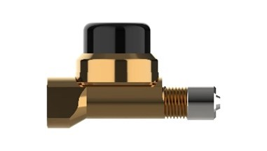
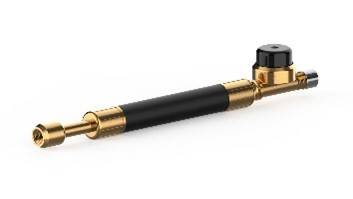
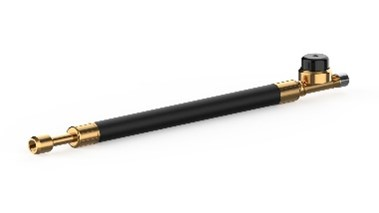
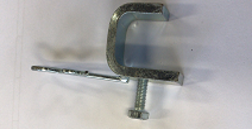
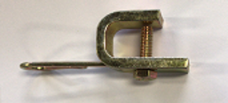

# Sensor Types and Accessories

## Sensor Types

|**Sensor Type** | **Optional installation position** | **Picture** |
|----------------|--------|:--------:|
| NLP Flow-through Sensor | Single tire or inner dual tires | { width="400px"}        |
| NLP Short Flexy-Sensor | Outer dual tires (+ rim clamp) | { width="400px"}             |
| NLP Long-Flexy Sensor | Inner dual tires (+ rim clamp)  | { width="400px"}       |

## Accessories

|**Description** | **Picture**                        |
|----------------|:--------:|
| Rim Clamp for Alloy Wheels | { width="400px"}        |
| Rim Clamp for Steel Wheels | { width="400px"} |
