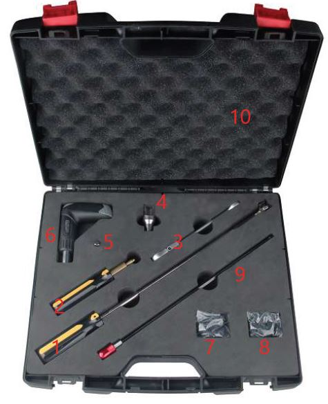
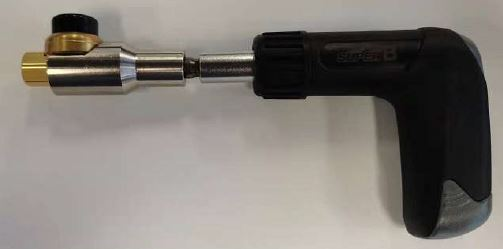
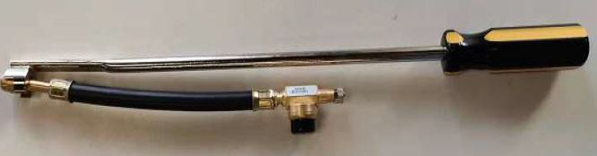
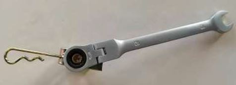

# Installation Tool Kit

## Overview

| **Installation Tool Kit**       |
|:----------------------:|
|  |

## Tool Kit Content

|**Number** | **Description**                        |
|:----------------:|--------|
| 1  | **Flexy Sensor** Fitting Tool with handle       |
| 2  | **Standard Sensor** O-Ring Fitting Tool             |
| 3  | Hinged Ratchet Combination Spanner (10mm for rim clamps)      |
| 4  | **Standard Sensor** Fitting Tool |
| 5  | Adapter (Fitting tool to Torque Driver) |
| 6  | Torque Driver (fixed to 4Nm) |
| 7  | O-Ring (Standard Sensor) |
| 8  | O-Ring (Flexy Sensor) |
| 9  | 300mm Extension Bar for Torque Driver |

## Tool Kit How To

|**Description** | **Items used** | **Picture** |
|----------------|:--------:|:--------:|
| **Standard Sensor** Installation on single tires | 4+5+6 |         |
| **Standard Sensor** Installation on dual tires | 4+5+6+9 | .JPG)            |
| **Flexy Sensor** Installation | 1  |        |
| Rim Clamp Installation | 3  |       |
| O-Ring Replacement | 2  |        |
