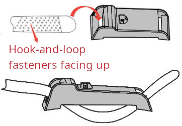
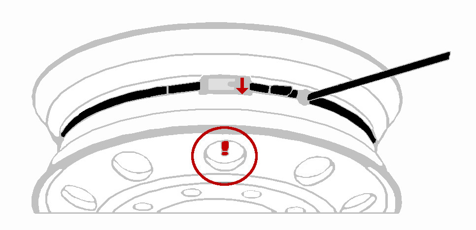
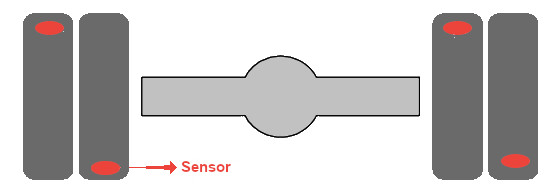

# Strap-mounted Sensor

## Installation and Maintenance

- Suitable for all European heavy-duty rims.
- An extended velcro length allow for installations on rims from 17 inches to 24,5 inches.
- The maximum permissible speed for a strap sensor with a strap is 130 km/h.
- Thoroughly degrease and clean the rim before attaching the sensor with the band.
- For conical rims, the strap must be positioned on the smallest diameter of the wheel.

## Mechanical Features

- Weight: 71.5g.
- Dimensions: 84x32x23mm (LxWxH).
- Water proof: IP67, IP69K.
- Material: Plastic.

## Fitment Instruction

|**Fitment Steps** | **Picture**                        |
|----------------|:--------:|
| 1. Insert the strap, with the Velcro side facing up, first through the left side and then out through the right side. Pull the strap until the sensor is positioned near the sensor fitting area. | { width="600px"}    |
| 2. Align the white valve icon on the sensor with the center of the valve hole and tighten the strap. Ensure the sensor is securely fixed and cannot move or slip. Once the two layers of the strap are bonded together, apply additional pressure along the strap layers to ensure they are firmly secured.  |  { width="600px"}     |
| 3. When fitting the tire, ensure that the sensor does not come into contact with the tire. While mounting the second tire wall, avoid any contact between the mounting tool and the sensor.  | { width="600px"}    |
| 4. Place the tire in an inflation safety cage and inflate the tire to the required pressure value.  | { width="600px"}        |
| 5. For twin wheels, to help with TPMS readings, offsetting the valves prevents signal interference, which can cause incorrect readings.  | { width="600px"}        |

### Caution

- Verify that the sensor is compatible with your vehicle before mounting.
- Sensor maintenance must be carried out by a skilled technician.
- Read through these instructions before sensor installation.
- Ensure that no contact takes place between the bead breaker blade and the sensor, avoiding any potential damage to the sensor.
- You must service/replace the valve each time the tyre is removed to uphold the sensor warranty.
- The sensor is only approved for use with one-piece rims.

### Sensor & Strap Areas

{ width="800px"}

### Sensor and Strap Disposal

{ width="800px"}

