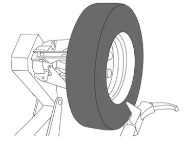
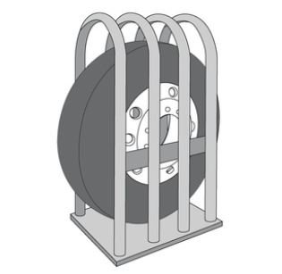

# Valve-mounted Sensor

## Installation and Maintenance

- Suitable for a varitey of valves.
- Valve nozzle distance is adjustable.

## Mechanical Features

- Weight: 71.5g.
- Dimensions: 102x62x39mm (LxWxH).
- Water proof: IP67, IP69K
- Material: Plastic, brass

## Fitment Instruction

|**Fitment Steps** | **Picture**                        |
|----------------|:--------:|
| 1. Secure the valve to the sensor with the screw and a torque of 5Nm.  | { width="400px"}        |
| 2. Put the valve through the valve hole, ensuring the rubber grommet makes good contact all around. Attach the nut to the valve by hand. Then, tigthen the nut with a torque tool to 12-15Nm.  | { width="400px"}             |
| 3. Remount the tire to the rim, ensuring the valve is opposite the tire fitting head.  | { width="400px"}       |
| 4. Place the tire in an inflation safety cage and inflate the tire to the required pressure value.  | { width="400px"}        |

### Caution

- Sensor maintenance must be carried out by a skilled technician.
- Read through these instructions before sensor installation.
- Ensure that no contact takes place between the bead breaker blade and the valve assembly, avoiding any potential damage to the sensor or valve.
- You must service/replace the valve each time the tyre is removed to uphold the sensor warranty.
- Secure the valve to the sensor with the screw and a torque of 5Nm.
- Secure the sensor to the whee with the nut and a torque of 12-15Nm.

### Sensor & Valve Exploded View

{ width="600px"}

!!! note "Note"

    Pictured valve is for demonstration purposes only. The correct valve to be installed will be determined by the wheel fitter based on the wheel requirements.
